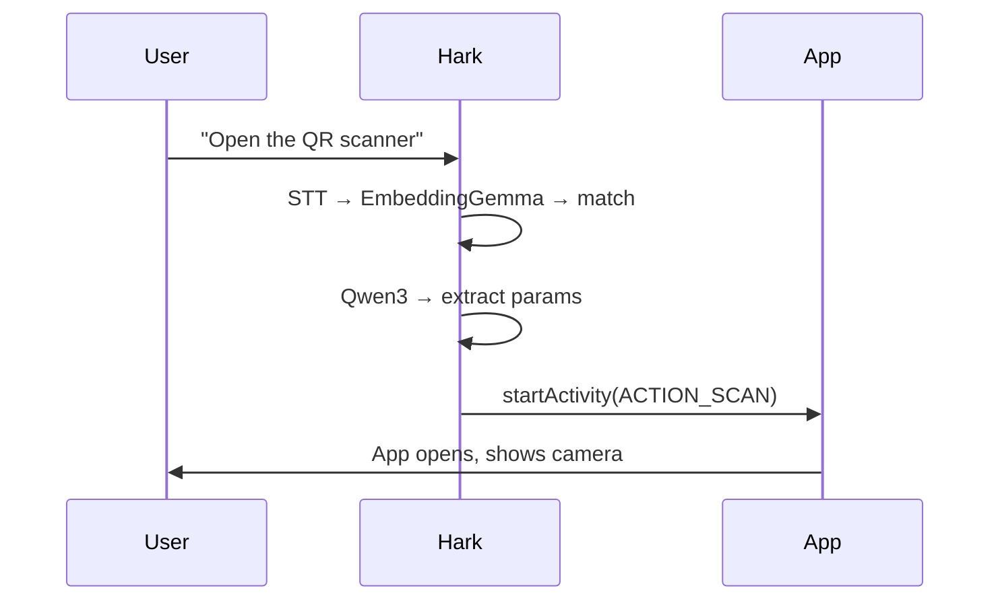
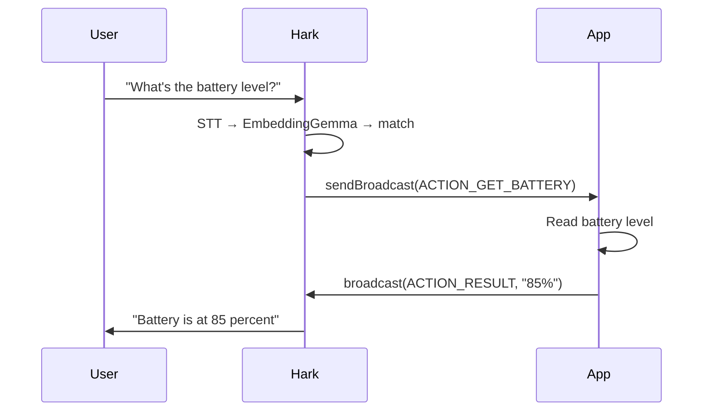
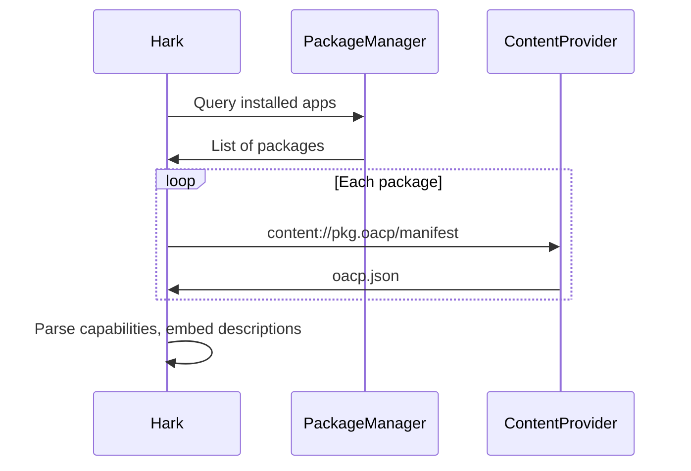

OACP treats installed apps as self-describing toolkits rather than hardcoded integrations. Each app ships an `oacp.json` manifest and an `OACP.md` context file, exposed via a standard Android `ContentProvider`. The voice assistant discovers these at runtime and resolves commands without any server-side registry.

## Flow 1: Foreground Handoff

Actions like opening a camera, scanning a QR code, or navigating to a screen require the app to be visible. The assistant launches the app directly.

No result is expected from the target app. The assistant confirms based on the action it dispatched.

## Flow 2: Two-Way Communication (Async Result)

Actions like weather queries, reading counter values, or checking battery level do not need the app to open. The target app processes the request in the background and `sendBroadcast()`s a result back.

The user never leaves the assistant. Results appear inline in the conversation and the assistant speaks the answer.

## Discovery

At startup (and on app install), the assistant scans for `ContentProvider`s matching the `*.oacp` authority pattern. For each provider it reads:

- `/manifest` - the `oacp.json` file, parsed into capability objects that drive resolution.
- `/context` - the `OACP.md` file, fetched and validated for presence. Currently reserved for future models with larger context windows that can consume the extra semantic detail.

## Why two models?

Hark uses one model for matching and one model for extraction:

- **[EmbeddingGemma](https://ai.google.dev/gemma/docs/core/embedding_gemma)** (encoder) classifies the user's utterance against all known capabilities using semantic similarity. Fast, accurate, and lightweight.
- **[Qwen3 0.6B](https://huggingface.co/Qwen/Qwen3-0.6B)** (LLM) extracts structured parameters from the matched utterance.

This two-stage approach keeps each model's prompt small enough to fit within on-device context limits while maintaining high accuracy.
